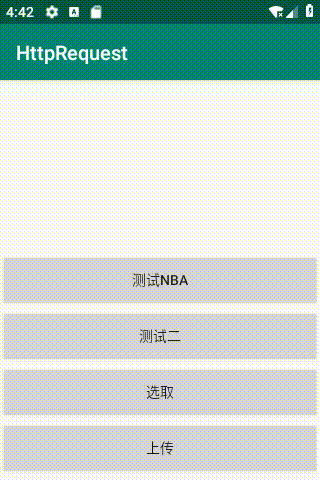

# HttpRequest

基于Retrofit2+RxJava+OkHttp3+RxLifecycle3的网络请求框架

#### 1、添加依赖和配置

* 工程添加依赖仓库，Add the JitPack repository to your build file

```Java
allprojects {
   repositories {
   		...
   	    maven { url 'https://jitpack.io' }
   }
}
```

```Java
dependencies {
   implementation 'com.github.Mp5A5:HttpRequest:1.0.0'
}
```

#### 2、使用步骤

###### 1.在Application类中进行初始化操作

```Java
class App : Application() {
    override fun onCreate() {
        super.onCreate()

        val baseUrl = "http://op.juhe.cn/"
        val headMap = ArrayMap<String, String>()
        headMap["key1"] = "value1"
        headMap["key2"] = "value2"
        headMap["key3"] = "value3"


        val build = ApiConfig.Builder()
            .setBaseUrl(baseUrl)//BaseUrl，这个地方加入后项目中默认使用该url
            .setInvalidateToken(200)//Token失效码
            .setSucceedCode(0)//成功返回码

            //Token失效后发动态广播的Filter，配合BaseObserver中的标识进行接收使用
            // public static final String TOKEN_INVALID_TAG = "token_invalid";
            // public static final String QUIT_APP = "quit_app";
            //注册Token失效，退出登录的动态广播
            /**
             * private inner class QuitAppReceiver : BroadcastReceiver() {

                    override fun onReceive(context: Context?, intent: Intent?) {

                            if (ApiConfig.getQuitBroadcastReceiverFilter() == intent?.action) {

                                    val msg = intent?.getStringExtra(BaseObserver.TOKEN_INVALID_TAG)

                                    if (!TextUtils.isEmpty(msg)) {
                                            toast("$msg")
                                            //Toast.makeText(this@MainActivity,msg,Toast.LENGTH_SHORT).show()
                                    }
                            }
                    }
            }
             */

            //onCreate中
            /**
             *   private fun initReceiver() {
                    val filter = IntentFilter()
                    filter.addAction(ApiConfig.getQuitBroadcastReceiverFilter())
                    registerReceiver(quitAppReceiver, filter)
            }
             */

            .setFilter("com.mp5a5.quit.broadcastFilter")
            //.setDefaultTimeout(2000)//响应时间，可以不设置，默认为2000毫秒
            //.setHeads(headMap)//动态添加的header，也可以在其他地方通过ApiConfig.setHeads()设置
            .build()
        build.init(this)

    }
}
```
###### 2.定义接口

```Java
interface NBAApi {

    @GET("onebox/basketball/nba")
    fun getNBAInfo(@QueryMap map: ArrayMap<String, @JvmSuppressWildcards Any>): Observable<NBAEntity>
}

```

###### 3.创建实例

```Java
object NBAService {

    private val mNBAApi = RetrofitFactory.getInstance().create(NBAApi::class.java)

    fun getNBAInfo(key: String): Observable<NBAEntity> {
        val arrayMap = ArrayMap<String, Any>()
        arrayMap["key"] = key
        return mNBAApi.getNBAInfo(arrayMap)
    }
}

或者

//这中方式用于app中存在其他BaseUrl的请求----->一般不会用到，推荐使用第一种，因为application中已经注册
object NBAServiceT {

    private val mNBAApi = RetrofitFactory.getInstance().create("http://www.baidu.com",NBAApi::class.java)

    fun getNBAInfo(key: String): Observable<NBAEntity> {
        val arrayMap = ArrayMap<String, Any>()
        arrayMap["key"] = key
        return mNBAApi.getNBAInfo(arrayMap)
    }
}

```

###### 4.发送请求,接收参数

```Java

btnNBA.setOnClickListener {
            NBAService
                .getNBAInfo("6949e822e6844ae6453fca0cf83379d3")
                .subscribeOn(Schedulers.io())
                .observeOn(AndroidSchedulers.mainThread())
                .compose(this.bindToLifecycle())
                .subscribe(object : BaseObserver<NBAEntity>(this,true) {
                    override fun onSuccess(response: NBAEntity?) {
                        toast(response?.result?.title!!)
                        //设置成功后的Token
                        //ApiConfig.setToken(response?.token)
                    }

                    //失败和错误回调，默认可以不重写，父类已经做了Toast处理，如果需要展示错误页面等，可以重写
                    <!--override fun onFailing(response: NBAEntity?) {
                        super.onFailing(response)
                    }

                    override fun onError(e: Throwable) {
                        super.onError(e)
                    }-->

                })
        }

tvTest.setOnClickListener {
    NBAServiceT
        .getNBAInfo("6949e822e6844ae6453fca0cf83379d3")
        .subscribeOn(Schedulers.io())
        .observeOn(AndroidSchedulers.mainThread())
        .compose(this.bindToLifecycle())
        .subscribe(object : BaseObserver<NBAEntity>() {
            override fun onSuccess(response: NBAEntity?) {
                toast(response?.result?.title!!)
            }

        })
}

```

#### 3、效果展示



